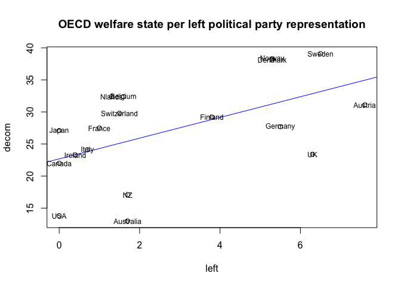

Assignment 1: Bivariate Regression
================
Serena Choi
1/23/2022

## Bivariate Regression and Residuals

In this assignment, we will perform a bivariate linear regression
analysis of the OECD welfare state data. The objective is to test the
null hypothesis that governments controlled by left/labor parties do
*not* have more egalitarian welfare states.

``` r
oecd <- read.csv(file="oecd.csv")
```

## Research question

This research question asks whether there is a relationship between
welfare state development and the legislative & cabinet seat shares for
left or labour parties among the OECD countries.

We can write a regression equation: *y = B0 + B1x + e* where y (response
variable) is represented by **decom** and x (explanatory variable) is
represented by **left**.

Our null hypothesis is as follows: *H0 = B1 = 0* which means that the
slope of the regression equation is 0.

## Estimating a model

We will examine the relationship between gdp and decom.  
The *slope* of the regression equation, B1, can be found using the
following equation: cov(x,y)/var(x)

``` r
B1 <- cov(oecd$left, oecd$decom)/var(oecd$left)
B1
```

    ## [1] 1.613986

The intercept is as follows: B0 = ybar - B1 \* xbar

``` r
B0 <- mean(oecd$decom) - (B1*mean(oecd$left))
B0
```

    ## [1] 22.68766

Finally, the linear regression model and its summary statistiscs are as
follows:

``` r
model1 <- lm(decom ~ left, data=oecd)
summary(model1)
```

    ## 
    ## Call:
    ## lm(formula = decom ~ left, data = oecd)
    ## 
    ## Residuals:
    ##      Min       1Q   Median       3Q      Max 
    ## -12.4314  -3.8619   0.3309   5.6139   7.6142 
    ## 
    ## Coefficients:
    ##             Estimate Std. Error t value Pr(>|t|)    
    ## (Intercept)  22.6877     2.3496   9.656 4.46e-08 ***
    ## left          1.6140     0.6249   2.583     0.02 *  
    ## ---
    ## Signif. codes:  0 '***' 0.001 '**' 0.01 '*' 0.05 '.' 0.1 ' ' 1
    ## 
    ## Residual standard error: 6.686 on 16 degrees of freedom
    ## Multiple R-squared:  0.2943, Adjusted R-squared:  0.2502 
    ## F-statistic: 6.672 on 1 and 16 DF,  p-value: 0.02002

The key analyses from the model summary table above are:

1.  The **intercept**, B0, is 22.6877. As we discussed in the class,
    this number does not have much meaning as countries rarely have 0
    seat shares of left or labor parties in reality.

2.  The **slope**, B1, is 1.6140, indicating a positive relationship
    between the two variables (decom & left). It can be interpreted that
    the 1.6140 unit increase in y (welfare state development) for a one
    unit increase in x (left seat share).

3.  Both the t-statistic of 2.583 and the p-value of 0.02002 indicate
    that **we can reject the null hypothesis**. Therefore, the changes
    in left/labor party seats are related to changes in welfare
    development.

4.  However, the **R-squared** value is pretty low, indicating the model
    is a poor fit to data overall.

## Residuals

The scatterplot of data and the regression line look like the below:

``` r
plot(oecd$left, oecd$decom, main="OECD welfare state per left political party representation", 
     xlab="left", ylab="decom")
abline(a=B0, b=B1, col="blue")
text(oecd$left, oecd$decom, labels=oecd$X, cex=0.75, 
     font=1)
```

<!-- -->

By examining the residuals, we can see that in countries such as
*Canada, Ireland, Italy and Finland,* left party representation is a
**strong** predictor of decommodification. On the other hand, In
countries such as *USA, Australia, NZ, Netherlands, UK, Denmark and
Norway,* left party representation is a **poor** predictor of welfare
state development.
