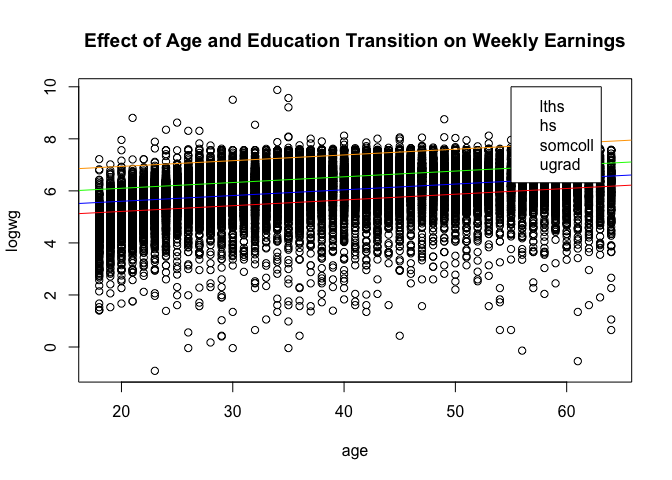
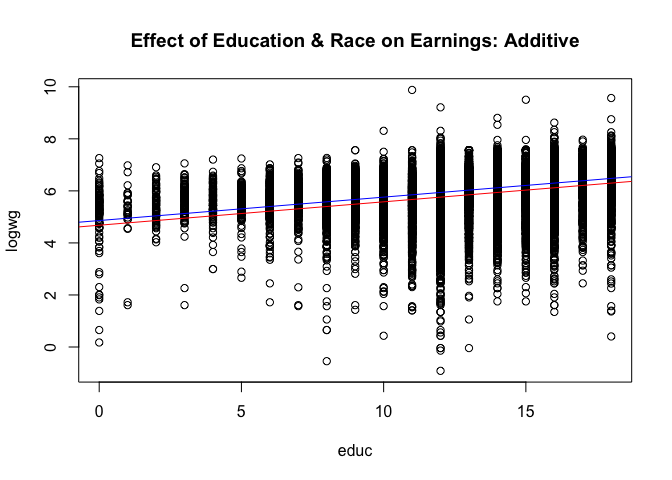
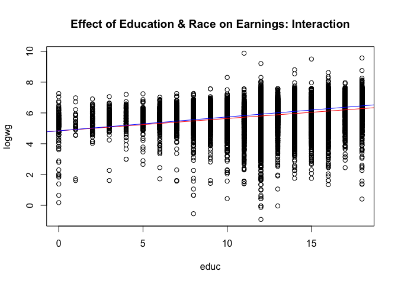

Assignment 3: Categorical Variables and Interaction Effects
================
Serena Choi
2/6/2022

For this assignment, we will use the U.S. CPS data.

``` r
cps <- read.csv(file="cps.csv")
race <- cps$race
age <- cps$age
educ <- cps$educ
logwg <- cps$logwg
```

## Model Estimation

### 1. Effect of age and education on weekly wages

#### Education as a continuous measure

**Model 1** considers age and education as both *continuous* variables.
Setting log weekly wages as dependent variable, it examines the effect
of education on earnings, net of age, and vice versa.

``` r
model1 <- lm(logwg ~ age + educ)
summary(model1)
```

    ## 
    ## Call:
    ## lm(formula = logwg ~ age + educ)
    ## 
    ## Residuals:
    ##     Min      1Q  Median      3Q     Max 
    ## -6.6730 -0.2998  0.1057  0.4427  4.0831 
    ## 
    ## Coefficients:
    ##              Estimate Std. Error t value Pr(>|t|)    
    ## (Intercept) 4.0575458  0.0218683  185.54   <2e-16 ***
    ## age         0.0222506  0.0003459   64.33   <2e-16 ***
    ## educ        0.0891852  0.0013650   65.34   <2e-16 ***
    ## ---
    ## Signif. codes:  0 '***' 0.001 '**' 0.01 '*' 0.05 '.' 0.1 ' ' 1
    ## 
    ## Residual standard error: 0.7131 on 31636 degrees of freedom
    ## Multiple R-squared:  0.218,  Adjusted R-squared:  0.218 
    ## F-statistic:  4410 on 2 and 31636 DF,  p-value: < 2.2e-16

#### Education as a categorical variable

Instead of a continuous variable, education can be modeled as a
*categorical* variable. We will create four categorical variables
depending on education level:

``` r
lths <- as.numeric(cps$educ < 12)
hs <- as.numeric(cps$educ == 12)
somecoll <- as.numeric (cps$educ >12 & cps$educ < 16)
ugrad <- as.numeric(cps$educ >= 16)
```

When modelling with these categorical variables, we will set the first
group (education less than high school; “lths”) as referent. Hence,
**Model 2** looks like the following:

``` r
model2 <- lm(logwg ~ age + hs + somecoll + ugrad)
summary(model2)
```

    ## 
    ## Call:
    ## lm(formula = logwg ~ age + hs + somecoll + ugrad)
    ## 
    ## Residuals:
    ##     Min      1Q  Median      3Q     Max 
    ## -6.6463 -0.3015  0.1010  0.4403  4.3661 
    ## 
    ## Coefficients:
    ##             Estimate Std. Error t value Pr(>|t|)    
    ## (Intercept) 4.769839   0.016569  287.87   <2e-16 ***
    ## age         0.021831   0.000347   62.92   <2e-16 ***
    ## hs          0.388718   0.012027   32.32   <2e-16 ***
    ## somecoll    0.500581   0.013424   37.29   <2e-16 ***
    ## ugrad       0.839866   0.012885   65.18   <2e-16 ***
    ## ---
    ## Signif. codes:  0 '***' 0.001 '**' 0.01 '*' 0.05 '.' 0.1 ' ' 1
    ## 
    ## Residual standard error: 0.7111 on 31634 degrees of freedom
    ## Multiple R-squared:  0.2225, Adjusted R-squared:  0.2224 
    ## F-statistic:  2263 on 4 and 31634 DF,  p-value: < 2.2e-16

### 2. Interaction effect between education and race

**Model 3** is a simple additive model that looks at the effects of
education and race on earnings.

``` r
model3 <- lm(logwg ~ educ + race)
summary(model3)
```

    ## 
    ## Call:
    ## lm(formula = logwg ~ educ + race)
    ## 
    ## Residuals:
    ##     Min      1Q  Median      3Q     Max 
    ## -6.8859 -0.3356  0.1142  0.4834  4.1803 
    ## 
    ## Coefficients:
    ##             Estimate Std. Error t value Pr(>|t|)    
    ## (Intercept)  4.68210    0.02369  197.64   <2e-16 ***
    ## educ         0.09235    0.00145   63.71   <2e-16 ***
    ## race         0.17939    0.01601   11.20   <2e-16 ***
    ## ---
    ## Signif. codes:  0 '***' 0.001 '**' 0.01 '*' 0.05 '.' 0.1 ' ' 1
    ## 
    ## Residual standard error: 0.7568 on 31636 degrees of freedom
    ## Multiple R-squared:  0.1192, Adjusted R-squared:  0.1192 
    ## F-statistic:  2141 on 2 and 31636 DF,  p-value: < 2.2e-16

**Model 4**, in comparison, adds the interaction variable between
education and race.

``` r
model4 <- lm(logwg ~ educ + race + educ*race)
summary(model4)
```

    ## 
    ## Call:
    ## lm(formula = logwg ~ educ + race + educ * race)
    ## 
    ## Residuals:
    ##     Min      1Q  Median      3Q     Max 
    ## -6.8850 -0.3346  0.1160  0.4843  4.1613 
    ## 
    ## Coefficients:
    ##             Estimate Std. Error t value Pr(>|t|)    
    ## (Intercept) 4.845673   0.074031  65.455   <2e-16 ***
    ## educ        0.079201   0.005820  13.608   <2e-16 ***
    ## race        0.004440   0.076705   0.058   0.9538    
    ## educ:race   0.014015   0.006009   2.332   0.0197 *  
    ## ---
    ## Signif. codes:  0 '***' 0.001 '**' 0.01 '*' 0.05 '.' 0.1 ' ' 1
    ## 
    ## Residual standard error: 0.7568 on 31635 degrees of freedom
    ## Multiple R-squared:  0.1194, Adjusted R-squared:  0.1193 
    ## F-statistic:  1429 on 3 and 31635 DF,  p-value: < 2.2e-16

## Interpretation

**Model 1** is based on the assumption that both age and education are
*continuous*. That is, a unit increase in age is associated with, on
average, a 0.022 unit increase in log weekly wage, net of education.
Similarly, a unit increase in education is associated with, on average,
0.089 unit increase in log weekly wage. Looking at both t-values,
compared to standard errors, and p-values, we can conclude that both
variables are statistically significant, and therefore, we can reject
the null hypotheses, where coefficients are 0. Looking at the adjusted
R-square value, this model accounts for about 21% of variance of y.
While it is not terrible, the model does not fit the observations quite
well.

``` r
summary(model1)
```

    ## 
    ## Call:
    ## lm(formula = logwg ~ age + educ)
    ## 
    ## Residuals:
    ##     Min      1Q  Median      3Q     Max 
    ## -6.6730 -0.2998  0.1057  0.4427  4.0831 
    ## 
    ## Coefficients:
    ##              Estimate Std. Error t value Pr(>|t|)    
    ## (Intercept) 4.0575458  0.0218683  185.54   <2e-16 ***
    ## age         0.0222506  0.0003459   64.33   <2e-16 ***
    ## educ        0.0891852  0.0013650   65.34   <2e-16 ***
    ## ---
    ## Signif. codes:  0 '***' 0.001 '**' 0.01 '*' 0.05 '.' 0.1 ' ' 1
    ## 
    ## Residual standard error: 0.7131 on 31636 degrees of freedom
    ## Multiple R-squared:  0.218,  Adjusted R-squared:  0.218 
    ## F-statistic:  4410 on 2 and 31636 DF,  p-value: < 2.2e-16

**Model 2** still looks at the effect of age and education on weekly
wages. However, the difference from Model 1 is that Model 2 considers
education as a *categorical variable*. This allow us to compare more
than two groups of education levels and further examine effect of
educational transitions on wages. In this model, less than high school
group is set as the referent. Hence, the intercept, 4.770, represents
the log weekly wages for high school dropouts, net of age. The
coefficient estimates for the other variables show the average
differences in log weekly wages depending on education levels. We can
test the hypothesis that all the slope coefficients are 0 using a basic
F-test. Looking at the F-statistic value, we can reject the null and
determine that all variables here are statistically significant. The fit
of Model 2 is similar to that of Model 1.

``` r
summary(model2)
```

    ## 
    ## Call:
    ## lm(formula = logwg ~ age + hs + somecoll + ugrad)
    ## 
    ## Residuals:
    ##     Min      1Q  Median      3Q     Max 
    ## -6.6463 -0.3015  0.1010  0.4403  4.3661 
    ## 
    ## Coefficients:
    ##             Estimate Std. Error t value Pr(>|t|)    
    ## (Intercept) 4.769839   0.016569  287.87   <2e-16 ***
    ## age         0.021831   0.000347   62.92   <2e-16 ***
    ## hs          0.388718   0.012027   32.32   <2e-16 ***
    ## somecoll    0.500581   0.013424   37.29   <2e-16 ***
    ## ugrad       0.839866   0.012885   65.18   <2e-16 ***
    ## ---
    ## Signif. codes:  0 '***' 0.001 '**' 0.01 '*' 0.05 '.' 0.1 ' ' 1
    ## 
    ## Residual standard error: 0.7111 on 31634 degrees of freedom
    ## Multiple R-squared:  0.2225, Adjusted R-squared:  0.2224 
    ## F-statistic:  2263 on 4 and 31634 DF,  p-value: < 2.2e-16

As you can see in the plot below, Model 2 assumes that the slopes of
each group are parallel. That is, the net effect of one variable is the
same regardless of levels of the other variables in the model.

``` r
plot1 <- plot(age, logwg, main = "Effect of Age and Education Transition on Weekly Earnings")
abline(a=4.77, b=0.022, col="red")
abline(a=4.77+0.39, b=0.022, col="blue")
abline(a=4.77+0.39+0.5, b=0.022, col="green")
abline(a=4.77+0.39+0.5+0.84, b=0.022, col="orange")
legend(55,10, c("lths", "hs", "somcoll", "ugrad"), col=c("red", "blue", "green", "orange", pch(c("-"))))
```

<!-- -->

**Model 3** investigates the idea that the effect of education on
earnings may vary for black and white men in the U.S. Note that race
here is a dummy variable. Looking at the summary statistics below, we
can analyze that on average, white men earn 0.179 unit more in weekly
log wages than black men, net of education. This difference is
statistically significant. This model does not fit well as the adjusted
R-squared value is low.

``` r
summary(model3)
```

    ## 
    ## Call:
    ## lm(formula = logwg ~ educ + race)
    ## 
    ## Residuals:
    ##     Min      1Q  Median      3Q     Max 
    ## -6.8859 -0.3356  0.1142  0.4834  4.1803 
    ## 
    ## Coefficients:
    ##             Estimate Std. Error t value Pr(>|t|)    
    ## (Intercept)  4.68210    0.02369  197.64   <2e-16 ***
    ## educ         0.09235    0.00145   63.71   <2e-16 ***
    ## race         0.17939    0.01601   11.20   <2e-16 ***
    ## ---
    ## Signif. codes:  0 '***' 0.001 '**' 0.01 '*' 0.05 '.' 0.1 ' ' 1
    ## 
    ## Residual standard error: 0.7568 on 31636 degrees of freedom
    ## Multiple R-squared:  0.1192, Adjusted R-squared:  0.1192 
    ## F-statistic:  2141 on 2 and 31636 DF,  p-value: < 2.2e-16

Similar to Model 2, Model 3 also assumes that the slopes of both groups
are parallel. The only difference is in the intercept, which indicates
the average difference in earnings for black and white men.

``` r
plot2 <- plot(educ, logwg, main= "Effect of Education & Race on Earnings: Additive")
abline(a=4.68, b=0.09, col="red")
abline(a=4.68+0.18, b=0.09, col="blue")
legend(20,10, c("Black", "White"), col=c("red", "blue"))
```

<!-- -->

Different from Model 3, **Model 4** considers an *interaction effect*
between education and race by adding the variable, education\*race.
Given the summary statistics below, the race coefficient estimate,
0.004, is the difference between average log wages for black and white
men in the U.S. This is much smaller than that of Model 3. However, this
difference is not statistically significant when looking at t-value. The
interaction variable, however, is statistically significant at 0.05
level.

``` r
summary(model4)
```

    ## 
    ## Call:
    ## lm(formula = logwg ~ educ + race + educ * race)
    ## 
    ## Residuals:
    ##     Min      1Q  Median      3Q     Max 
    ## -6.8850 -0.3346  0.1160  0.4843  4.1613 
    ## 
    ## Coefficients:
    ##             Estimate Std. Error t value Pr(>|t|)    
    ## (Intercept) 4.845673   0.074031  65.455   <2e-16 ***
    ## educ        0.079201   0.005820  13.608   <2e-16 ***
    ## race        0.004440   0.076705   0.058   0.9538    
    ## educ:race   0.014015   0.006009   2.332   0.0197 *  
    ## ---
    ## Signif. codes:  0 '***' 0.001 '**' 0.01 '*' 0.05 '.' 0.1 ' ' 1
    ## 
    ## Residual standard error: 0.7568 on 31635 degrees of freedom
    ## Multiple R-squared:  0.1194, Adjusted R-squared:  0.1193 
    ## F-statistic:  1429 on 3 and 31635 DF,  p-value: < 2.2e-16

The major difference between Model 3 and Model 4 is that Model 4 does
not assume parallel slopes. This becomes clear when we plot Model 4:

``` r
plot3 <- plot(educ, logwg, main= "Effect of Education & Race on Earnings: Interaction")
abline(a=4.84, b=0.08, col="red")
abline(a=4.84+0.00, b=0.08+0.01, col="blue")
legend(20,10, c("Black", "White"), col=c("red", "blue"))
```

<!-- -->

The fact that the two groups (black and white) have different slopes
indicates that the net effect of education on earnings may vary
depending on race. We can compare Model 3 and Model 4 by conducting an
incremental F-test. Looking at the ANOVA summary statistics below, the F
ratio is 5. An F-ratio of 5 on 1 and 31635 df is significant at 0.05
level. Therefore, we can reject the null hypothesis of parallelism and
conclude that *there is an interaction between age and race*.

``` r
anova(model3, model4)
```

    ## Analysis of Variance Table
    ## 
    ## Model 1: logwg ~ educ + race
    ## Model 2: logwg ~ educ + race + educ * race
    ##   Res.Df   RSS Df Sum of Sq      F Pr(>F)  
    ## 1  31636 18120                             
    ## 2  31635 18117  1    3.1149 5.4389 0.0197 *
    ## ---
    ## Signif. codes:  0 '***' 0.001 '**' 0.01 '*' 0.05 '.' 0.1 ' ' 1

``` r
((18120-18117)/(1))/(18117/31635)
```

    ## [1] 5.23845
