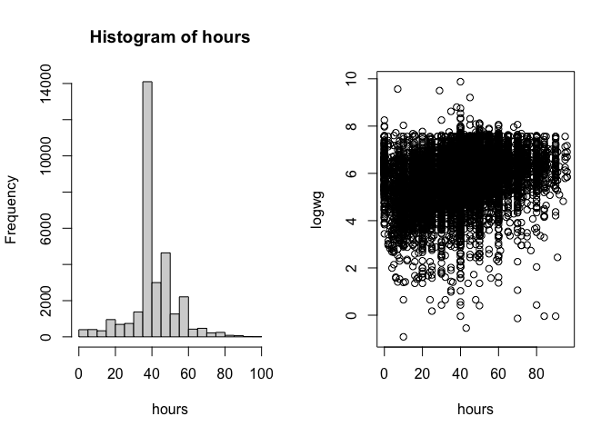
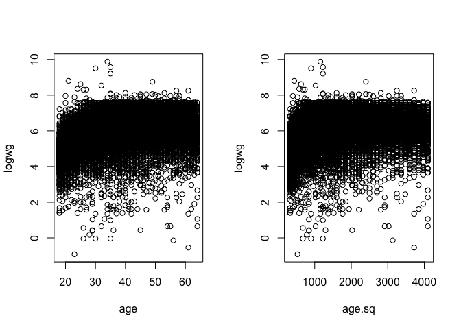

Assign4_Choi_Nonlinear_effects
================
Serena Choi
2/16/2022

## Research Question

In this assignment, we will examine the effect of work hours and age on
earnings. In examining potential associations, we will focus on whether
non-linear effects of independent variables on the response variable
exists. The research questions are:

1.  Are there non-linear effects of work hours on earnings?
2.  Are there non-linear effects of age on earnings?

``` r
cps <- read.csv(file = "cps.csv")  #setting the path, data and variable names 
hours <- cps$hours
logwg <- cps$logwg
age <- cps$age
race <- cps$race
educ <- cps$educ
```

## 1. Effect of work hour

Before delving into the research question, we will first examine the
histogram of work hours below. From looking at it, we can notice that
many work 40 hours per week, while others work part-times and work more
than 40 hours a week.

``` r
par(mfrow=c(1,2))   
summary(hours)      
```

    ##    Min. 1st Qu.  Median    Mean 3rd Qu.    Max. 
    ##    0.00   40.00   40.00   42.48   50.00   96.00

``` r
hist(hours) #histogram of working hours 
plot(hours, logwg)
```

<!-- -->

### 1.1. Work hours as a linear measure

Now, we will create Model 1, which sets the variable work hours as a
linear measure. We will also include control variables, education and
race. That is because, in the earlier assignments, we have observed that
effects of education and race on earnings are statistically significant.
I also looked at the potential of including the interacting variable,
educ\*race, which was proved to be statistically significant when
looking at only those two variables. Surprisingly, however, when age and
work hours variables were included, the effect of the interacting
variable turned out to be not significant. Therefore, we will omit this
interacting variable in Model 1 and the following models in this
assignment, while keeping education and race as control variables.

``` r
model1<- lm(logwg~ age + hours + educ + race, data=cps) #linear measure of work hours
summary(model1)
```

    ## 
    ## Call:
    ## lm(formula = logwg ~ age + hours + educ + race, data = cps)
    ## 
    ## Residuals:
    ##     Min      1Q  Median      3Q     Max 
    ## -6.9210 -0.3034  0.0907  0.4209  4.2283 
    ## 
    ## Coefficients:
    ##              Estimate Std. Error t value Pr(>|t|)    
    ## (Intercept) 3.4590339  0.0260571 132.748   <2e-16 ***
    ## age         0.0205140  0.0003345  61.323   <2e-16 ***
    ## hours       0.0152648  0.0003108  49.113   <2e-16 ***
    ## educ        0.0802481  0.0013254  60.547   <2e-16 ***
    ## race        0.1423788  0.0145269   9.801   <2e-16 ***
    ## ---
    ## Signif. codes:  0 '***' 0.001 '**' 0.01 '*' 0.05 '.' 0.1 ' ' 1
    ## 
    ## Residual standard error: 0.686 on 31634 degrees of freedom
    ## Multiple R-squared:  0.2765, Adjusted R-squared:  0.2764 
    ## F-statistic:  3022 on 4 and 31634 DF,  p-value: < 2.2e-16

According to Model 1, which treats both age and work hours as linear
measures, all independent variables are statistically significant. Thus,
changes in each independent variables are associated to changes in
earnings. The adjusted R-squared, 0.28, indicates that Model 1 fits
observations to a moderate extent.

### 1.2. Work hours as categorical measures

As creating categorical independent variables can help us identify
non-linear effects, we will recode work hours into categorical
variables. Thus, we will create 3 work hours groups: part-time (less
than 30 hours per week), full-time (between 30 to 40 hours per week),
and over-tie (over 40 hours per week).

``` r
part<- as.numeric(hours < 30) #categorical measures of work hours
full <- as.numeric(hours >= 30 & hours <= 40) 
over <- as.numeric(hours > 40)
```

In order to create a linear model with categorical variable, we should
set one group as the referent. We will create two models, Model 2 and 3,
with different group as the referent in order to examine the possibility
of non-linear effect.

Model 2 sets full-time group as the referent and include educ, race, and
educ\*race as control variables.

``` r
model2 <- lm(logwg~ age+ part+ over + educ + race) #full time is the referent
summary(model2)
```

    ## 
    ## Call:
    ## lm(formula = logwg ~ age + part + over + educ + race)
    ## 
    ## Residuals:
    ##     Min      1Q  Median      3Q     Max 
    ## -6.8242 -0.3023  0.0734  0.4025  4.2001 
    ## 
    ## Coefficients:
    ##               Estimate Std. Error t value Pr(>|t|)    
    ## (Intercept)  4.1166938  0.0242943  169.45   <2e-16 ***
    ## age          0.0196858  0.0003307   59.53   <2e-16 ***
    ## part        -0.6649090  0.0136962  -48.55   <2e-16 ***
    ## over         0.1633494  0.0081507   20.04   <2e-16 ***
    ## educ         0.0810941  0.0013105   61.88   <2e-16 ***
    ## race         0.1498657  0.0143419   10.45   <2e-16 ***
    ## ---
    ## Signif. codes:  0 '***' 0.001 '**' 0.01 '*' 0.05 '.' 0.1 ' ' 1
    ## 
    ## Residual standard error: 0.6755 on 31633 degrees of freedom
    ## Multiple R-squared:  0.2983, Adjusted R-squared:  0.2982 
    ## F-statistic:  2690 on 5 and 31633 DF,  p-value: < 2.2e-16

When the full-time group is set as the referent, the coefficients for
the part-time and over-time groups are significantly different. Thus,
the effect of work hours on earnings varies for different values of work
hours. Moreover, the effect of work hours is negatively associated with
earnings for the part-time group, as compared to the full-time group.

In comparison, Model 3 below sets the part-time group as the referent.

``` r
model3 <- lm(logwg~ age + full + over + educ + race) #part time is the referent
summary(model3)
```

    ## 
    ## Call:
    ## lm(formula = logwg ~ age + full + over + educ + race)
    ## 
    ## Residuals:
    ##     Min      1Q  Median      3Q     Max 
    ## -6.8242 -0.3023  0.0734  0.4025  4.2001 
    ## 
    ## Coefficients:
    ##              Estimate Std. Error t value Pr(>|t|)    
    ## (Intercept) 3.4517848  0.0260929  132.29   <2e-16 ***
    ## age         0.0196858  0.0003307   59.53   <2e-16 ***
    ## full        0.6649090  0.0136962   48.55   <2e-16 ***
    ## over        0.8282584  0.0140528   58.94   <2e-16 ***
    ## educ        0.0810941  0.0013105   61.88   <2e-16 ***
    ## race        0.1498657  0.0143419   10.45   <2e-16 ***
    ## ---
    ## Signif. codes:  0 '***' 0.001 '**' 0.01 '*' 0.05 '.' 0.1 ' ' 1
    ## 
    ## Residual standard error: 0.6755 on 31633 degrees of freedom
    ## Multiple R-squared:  0.2983, Adjusted R-squared:  0.2982 
    ## F-statistic:  2690 on 5 and 31633 DF,  p-value: < 2.2e-16

Similarly, when part-time group is set as referent, the coefficients for
full-time and over-time groups are significantly different. This
reaffirms that the effect of work hours on earnings varies across the
number of hours, and therefore, non-linear. In both Model 2 and 3, all
independent variables are statistically significant. The adjusted
R-square values for both models are similar. When compared to Model 1,
Model 2 and Model 3 fit comparatively better, indicating the model
improvement when we treat work hours variable as categorical instead of
linear measures.

## 2. Effect of age

Age is often used as a proxy for labor market experience, and it is
commonly accepted that if one has more market experience, they would be
likely earning more. However, the increase may not be linear, as some
might experience more or less gains in average earning at a certain
point of their career. Moreover, the wage may decrease past certain age
as they approach retirement. Therefore, I believe that there is a
theoretical reason to suspect that the relationship between age and
earnings might be non-linear. We will investigate such possibility by
using a quadratic term.

``` r
par(mfrow=c(1,2))
plot(age, logwg)

age.sq<-age^2   #create a new variable, age-squared
plot(age.sq, logwg)     
```

<!-- -->

Model 4 below examines the effect of age in quadratic term with relevant
control variables.

``` r
model4 <- lm(logwg~age + age.sq + hours + educ + race)
summary(model4) 
```

    ## 
    ## Call:
    ## lm(formula = logwg ~ age + age.sq + hours + educ + race)
    ## 
    ## Residuals:
    ##     Min      1Q  Median      3Q     Max 
    ## -6.7925 -0.2862  0.0840  0.4004  4.0949 
    ## 
    ## Coefficients:
    ##               Estimate Std. Error t value Pr(>|t|)    
    ## (Intercept)  1.979e+00  4.272e-02   46.32   <2e-16 ***
    ## age          1.134e-01  2.185e-03   51.92   <2e-16 ***
    ## age.sq      -1.173e-03  2.728e-05  -43.01   <2e-16 ***
    ## hours        1.263e-02  3.083e-04   40.96   <2e-16 ***
    ## educ         7.257e-02  1.301e-03   55.80   <2e-16 ***
    ## race         1.595e-01  1.413e-02   11.29   <2e-16 ***
    ## ---
    ## Signif. codes:  0 '***' 0.001 '**' 0.01 '*' 0.05 '.' 0.1 ' ' 1
    ## 
    ## Residual standard error: 0.6668 on 31633 degrees of freedom
    ## Multiple R-squared:  0.3164, Adjusted R-squared:  0.3163 
    ## F-statistic:  2929 on 5 and 31633 DF,  p-value: < 2.2e-16

According to Model 4, all independent variables, including age in the
squared term, are statistically significant. The signs of coefficients
for linear age variable and quadratic age variable are different,
suggesting that the effect of age on earnings change its direction at
one point. This point can be found by a simple calculation below:

``` r
#  x = -B1/2*B2
age.change <- ((-1)*1.134e-01)/(2*-1.173e-03)
age.change
```

    ## [1] 48.3376

Thus, according to Model 4, the effect of age on earnings change its
direction around age 48.

Finally, we will determine whether Model 4, which includes age in
quadratic term, fits better than Model 1, which specifies age as a
linear measure, using incremental F-test. Looking at the test summary
below, we can see that the F-ratio is very significant. Therefore, we
can reject the null-hypothesis of linearity and conclude that age also
has non-linear effects on earnings.

``` r
anova(model1, model4)  
```

    ## Analysis of Variance Table
    ## 
    ## Model 1: logwg ~ age + hours + educ + race
    ## Model 2: logwg ~ age + age.sq + hours + educ + race
    ##   Res.Df   RSS Df Sum of Sq      F    Pr(>F)    
    ## 1  31634 14886                                  
    ## 2  31633 14063  1     822.5 1850.1 < 2.2e-16 ***
    ## ---
    ## Signif. codes:  0 '***' 0.001 '**' 0.01 '*' 0.05 '.' 0.1 ' ' 1
