Assign5_Choi_OLS_Assumptions
================
Serena Choi

## Setting up

``` r
library(MASS)
```

    ## Warning: package 'MASS' was built under R version 4.1.2

``` r
library(lmtest)
```

    ## Loading required package: zoo

    ## 
    ## Attaching package: 'zoo'

    ## The following objects are masked from 'package:base':
    ## 
    ##     as.Date, as.Date.numeric

``` r
library(zoo)
library(sandwich)
library(readr)
```

``` r
charity <- read_csv("charity.csv")
```

    ## Rows: 2226 Columns: 6

    ## ── Column specification ────────────────────────────────────────────────────────
    ## Delimiter: ","
    ## dbl (6): give, age, sex, educ, income, trust

    ## 
    ## ℹ Use `spec()` to retrieve the full column specification for this data.
    ## ℹ Specify the column types or set `show_col_types = FALSE` to quiet this message.

``` r
attach(charity)

#recoding sex and educ as dummy variables (0 or 1)
#1=female; 0=Male
female <- as.numeric(charity$sex==2)
hist(female)
```

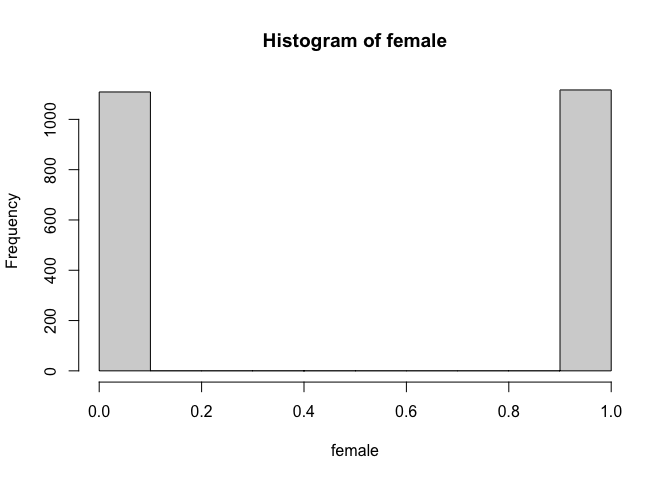<!-- -->

``` r
#1=university grad; 0=less than university
ugrad <- as.numeric(charity$educ==2)
hist(ugrad)
```

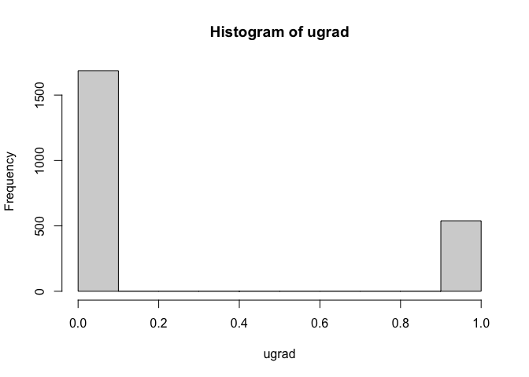<!-- -->

## Determinants of Charitable Giving

We will create a basic linear model, Model1, to see how income,
education, sex and age affect charitable donations.

``` r
Model1 <- lm(give~ income + age + female + ugrad, data=charity)
summary(Model1)
```

    ## 
    ## Call:
    ## lm(formula = give ~ income + age + female + ugrad, data = charity)
    ## 
    ## Residuals:
    ##     Min      1Q  Median      3Q     Max 
    ## -1759.2  -649.8  -267.8   119.9 18854.0 
    ## 
    ## Coefficients:
    ##               Estimate Std. Error t value Pr(>|t|)    
    ## (Intercept) -6.249e+02  1.122e+02  -5.571 2.83e-08 ***
    ## income       1.869e-02  1.498e-03  12.476  < 2e-16 ***
    ## age          1.009e+01  1.746e+00   5.779 8.57e-09 ***
    ## female      -8.152e+01  5.829e+01  -1.398    0.162    
    ## ugrad        4.124e+02  7.342e+01   5.618 2.18e-08 ***
    ## ---
    ## Signif. codes:  0 '***' 0.001 '**' 0.01 '*' 0.05 '.' 0.1 ' ' 1
    ## 
    ## Residual standard error: 1371 on 2221 degrees of freedom
    ## Multiple R-squared:  0.1203, Adjusted R-squared:  0.1187 
    ## F-statistic: 75.94 on 4 and 2221 DF,  p-value: < 2.2e-16

According to the linear model, income level is statistically significant
to charitable donations. There is a positive association, suggesting the
more a person earns, the more donation they would make. Age is also
statistically significant and positively associated with charity giving.
Being female is negatively associated with donation, however, it is not
a statistically significant determinant. Graduating university is both
positively associated with charitable giving and statistically
significant.

Yet, this linear model does not fit the observations well given the
value of adjusted R-squared. In the following section, we will check if
OLS assumptions are violated and if we can improve the model fit.

## OLS Assumptions

### Assumption 1: Distribution of errors is normal.

In order to check this normality assumption, we will create a QQ plot.

``` r
stand.res <- stdres(Model1)  # standardized residuals
qqnorm((stand.res),
       ylab="Standardized Residuals",
       xlab="Theoretical Quantiles",
       main="Figure 1. QQ plot of Standardized Residuals")

qqline((stand.res), col="magenta")
```

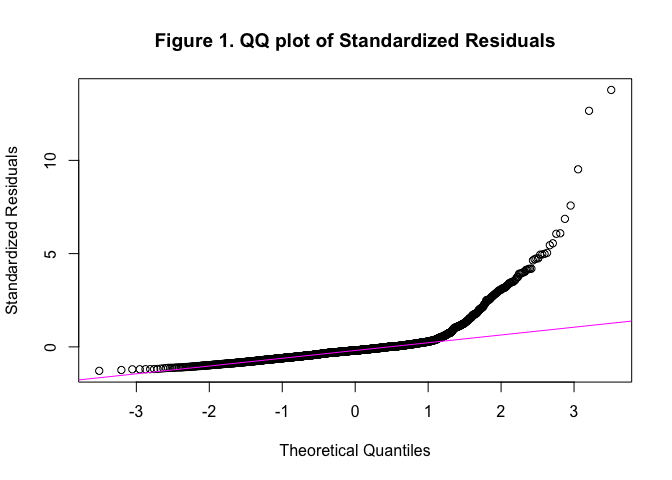<!-- -->
We can observe that some parts of QQ plot does not follow a straight
line, indicating some degree of non-normal distribution.

Alternatively, we can also examine the normality of residuals using a
histogram.

``` r
hist(stand.res, xlab="Standardized Residuals", 
     ylab="Frequency",
     main="Figure 2. Histogram of Standardized Residuals")
```

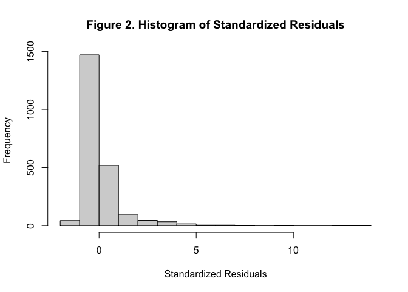<!-- -->
The histogram also shows that residuals are slightly skewed to the
right.

Looking at the QQ plot and the histogram of standardized residuals, we
can conclude that the OLS assumption 1 is violated to a certain degree.
That is, the *standardized residuals are not normally distributed*. This
is likely because some independent variables, such as income, is highly
skewed.

### Assumption 2: Mean of errors is zero.

If this assumption is violated, the intercept coefficient would be
biased. We will test this assumption by taking the mean of standardized
residuals.

``` r
mean(stand.res)
```

    ## [1] 4.099682e-07

``` r
plot(stand.res)
abline(h=mean(stand.res), col="red")  
abline(h=0, col="blue")  
```

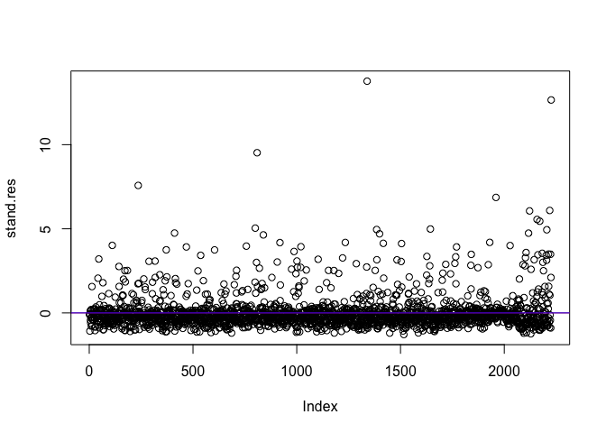<!-- -->
The mean of standardized residual is very close to zero. It can be also
determined by the plot above as the lines, each indicating the mean and
0 respectively, overlay each other. Therefore, we can conclude that *the
assumption 2 is not violated*, and therefore, the intercept is not
biased.

### Assumption 3: Error is constant across cases.

If the assumption of homoscedasticity were to be violated, the
coefficients would not be the best linear unbiased estimators and
standardized errors would be wrong.

We will first test this assumption by plotting standardized residuals
against fitted values of y.

``` r
plot(fitted(Model1), stand.res,
     xlab="Fitted Values of y",
     ylab="Standardized Residuals",
     main="Figure 3. Std. Residuals vs. Fitted Values for Model 1")
abline(h=0, col="red")
```

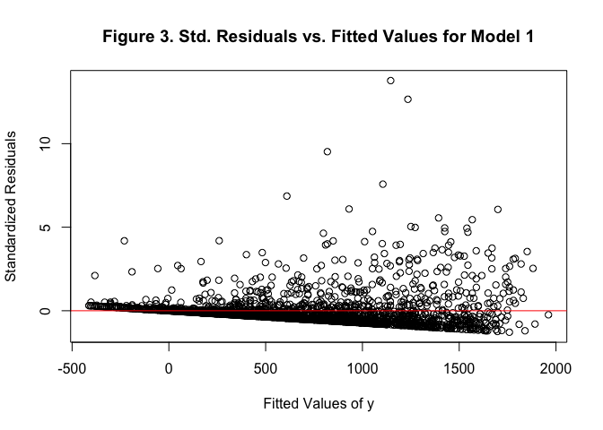<!-- -->
Looking at the plot above, we can observe that the standard residuals
for small fitted values are comparatively clustered while the standard
residuals for larger fitted values are more dispersed. This lead us to
suspect non-constant error variance.

Second, we will use a Breusch-Pagan test, of which the null hypothesis
indicates homoscedasticity, to confirm our suspicion.

``` r
bptest(Model1)
```

    ## 
    ##  studentized Breusch-Pagan test
    ## 
    ## data:  Model1
    ## BP = 42.905, df = 4, p-value = 1.083e-08

The small p-value suggest that we can reject the null hypothesis.
Therefore, we can conclude that *the variance of the errors is not
constant across cases*, and the OLS assumption of homoscedasticity is
violated. Thus, the coefficients of the Model 1 are not the best linear
unbiased estimators.

### Assumption 4: Error is unrelated to independent variables.

For this assumption, we will check the associations between the
residuals and each independent variable.

``` r
plot(income, stand.res,
     xlab="Income",
     ylab="Standardized Residuals",
     main="Figure 4. Std. Residuals vs. Income for Model 1")
abline(h=0, col="red")
```

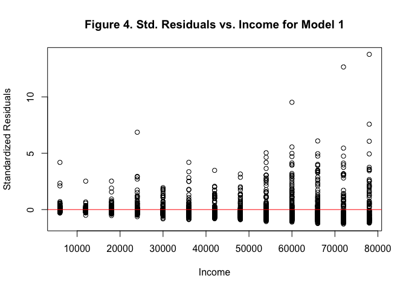<!-- -->

``` r
plot(charity$age, stand.res,
     xlab="Age",
     ylab="Standardized Residuals",
     main="Figure 5. Std. Residuals vs. Age for Model 1")
abline(h=0, col="green")
```

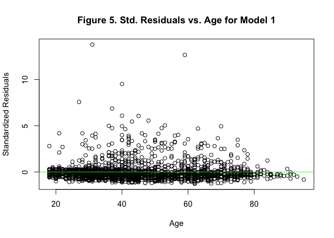<!-- -->

``` r
plot(female, stand.res,
     xlab="Female",
     ylab="Standardized Residuals",
     main="Figure 6. Std. Residuals vs. Female for Model 1")
abline(h=0, col="blue")
```

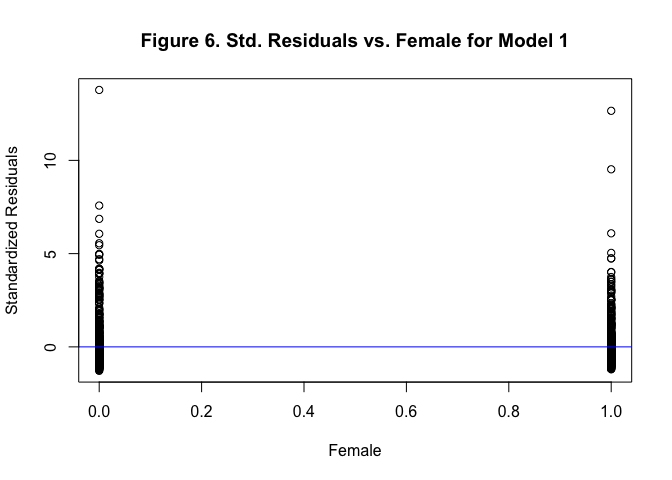<!-- -->

``` r
plot(ugrad, stand.res,
     xlab="University Grad",
     ylab="Standardized Residuals",
     main="Figure 7. Std. Residuals vs. UGrad for Model 1")
abline(h=0, col="pink")
```

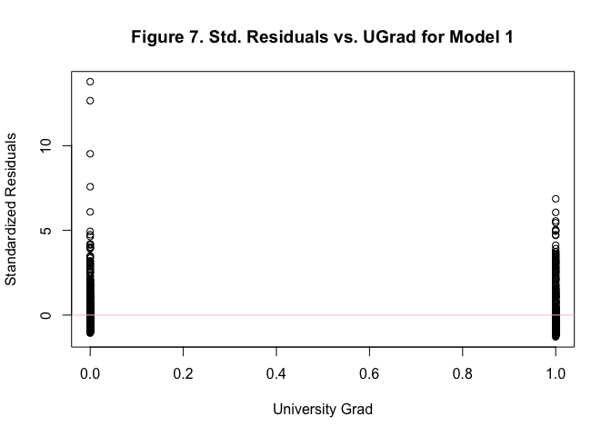<!-- -->
Looking at the four scatter plots, it is hard to conclude whether the
fourth assumption is violated or not. One thing to note is that the
scatter plot of standardized residuals against income (Fig.4) may be
slightly proportional. If it’s the case, we can suspect that error might
be related to the income variable.

## Dealing with Violations

In the previous section, we concluded that the first (*Normal
distribution*) and third (*homoscedasticity*) assumptions are surely
violated. There are also some suspicion that the fourth assumption
(*association between error and independent variable*) might also be
violated.

We can assume that the first assumption of normal distribution is likely
violated due to highly skewed independent variable. The non-constant
variance in errors could be the result of giving too much weight to a
subset of the data. For example, we have observed that for larger fitted
y value, the variance of residuals are bigger. Then, it can be suspected
that the data with high charity giving may have been over-weighted when
estimating coefficients.

Against the backdrop, we will try addressing these violations by
transforming the dependent variable. Specifically, we will transform it
into the log form as it normalizes the dependent variable as seen below.

``` r
par(mfrow=c(1,2)) 
hist(give)  
hist(log(give)) 
```

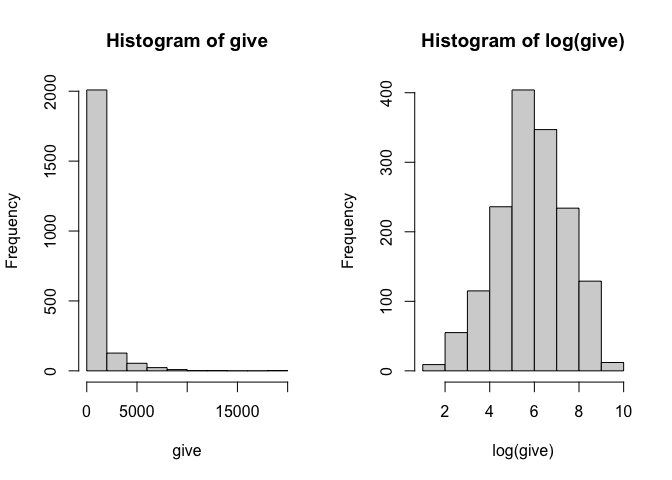<!-- -->

Hence, **Model 2** is created with log(y) as the dependent variable. We
will check to see how QQ plots and variance of residuals by fitted
values change.

``` r
Model2<-lm(log(give+1)~income + age+ female + ugrad, data=charity)
stand.res2<-stdres(Model2)
#QQ plots
qqnorm((stand.res),
       ylab="Standardized Residuals",
       xlab="Theoretical Quantiles",
       main="QQ plot without Transformation")
```

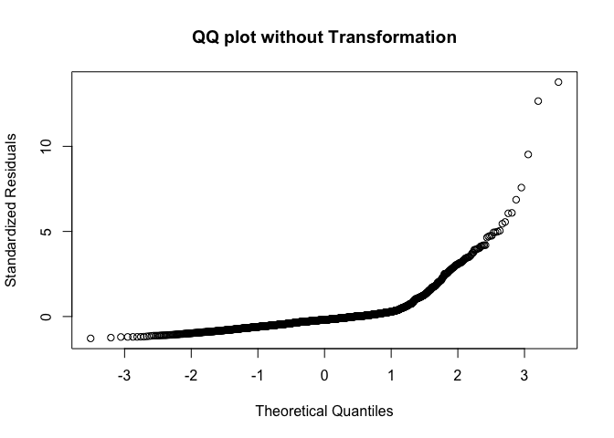<!-- -->

``` r
qqnorm((stand.res2),
       ylab="Standardized Residuals",
       xlab="Theoretical Quantiles",
       main="QQ plot with Transformation")
```

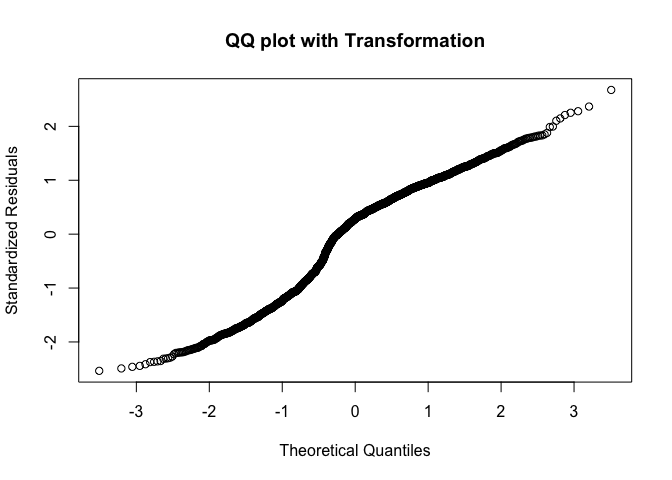<!-- -->
As seen above, QQ plots are closer to a straight line with the log
transformation, indicating the distribution of errors are more
normalized.

``` r
plot(fitted(Model1), stand.res, main="Std. Resids by Fitted(Give)")
```

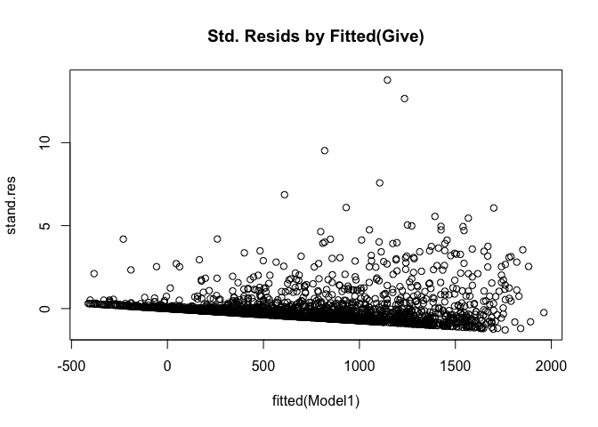<!-- -->

``` r
plot(fitted(Model2), stand.res2, main="Std. Resids by Fitted(Log Give)")
```

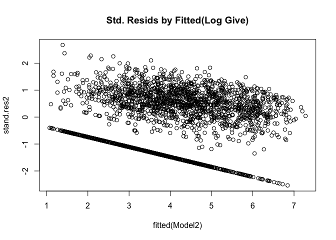<!-- -->
While we can observe a pattern of fanning out to a small degree,
transforming a dependent variable in log term still effectively
addresses the non-constant variance of the errors. Therefore, we can
conclude that the **log-transformation of the dependent variable is a
great choice to make the errors normal and constant across cases.**

Additionally, we will examine if another approach can be more effective
or not. We will try addressing the violations using **weighted least
squares**, by down-weighting income variable.

``` r
w <- (1/(charity$income))
Model3 <- lm(give~ income + age+ female + ugrad, data=charity, weights = w)
stand.res3<-stdres(Model3)
plot(fitted(Model3), stand.res3, main="Std. Resids by Fitted y with WLS")   
```

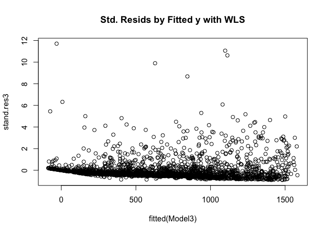<!-- -->
Looking at the scatter plot above, we can observe that using WLS has
addressed heteroscedasticity. However, when we look at the QQ plot
below, we can see that the distribution of the errors is not normalized.
Therefore, **WLS is not a good approach to address the assumption
violation in this case.**

``` r
qqnorm((stand.res3),
       ylab="Standardized Residuals",
       xlab="Theoretical Quantiles",
       main="QQ plot with WLS")
```

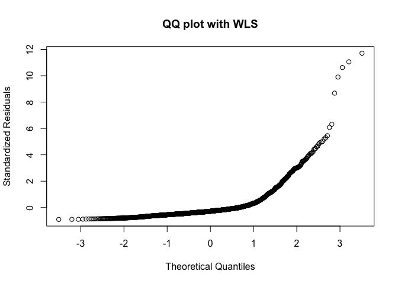<!-- -->
